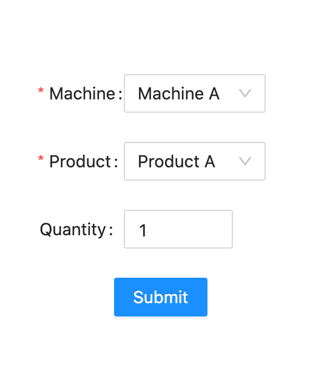
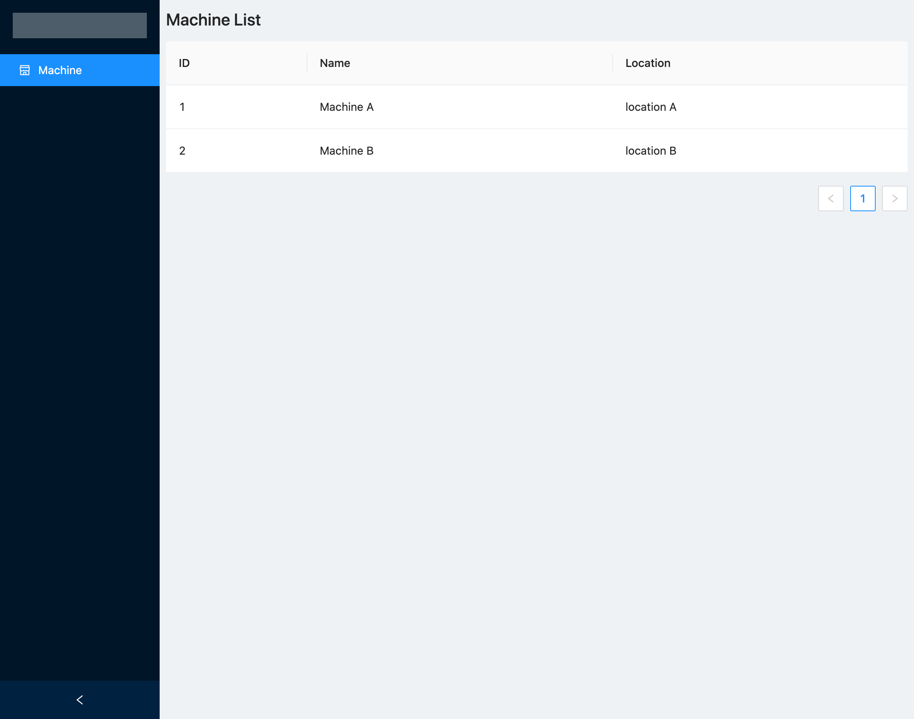
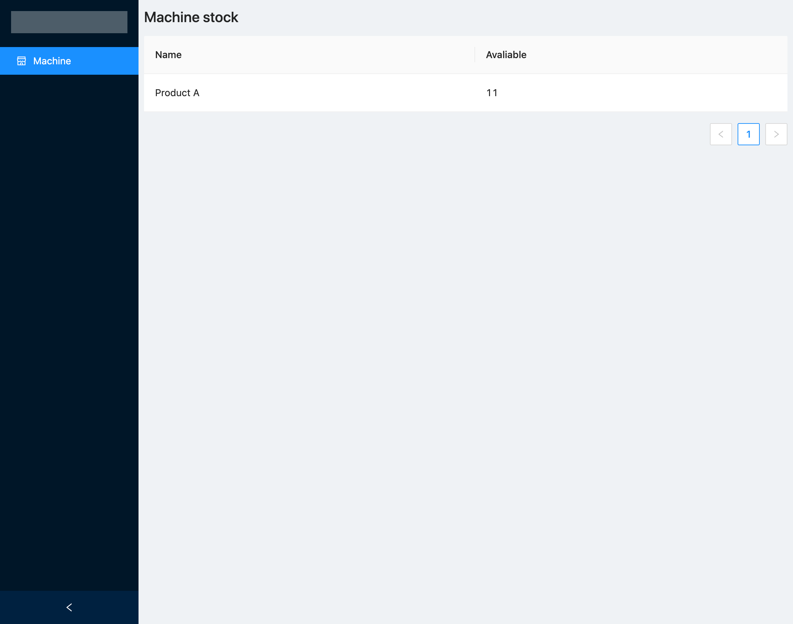
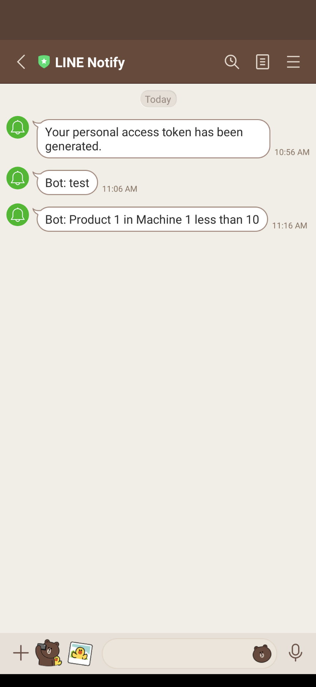

## Demo
- customer page
<br>
- machine list
<br>
- machine stock
<br>
- notify


## Run project
Backend
```
cd backend
npm install
npm start
```
Customer
```
cd customer
npm install
npm run dev
```
Admin
```
cd admin
npm install
npm run dev
```
